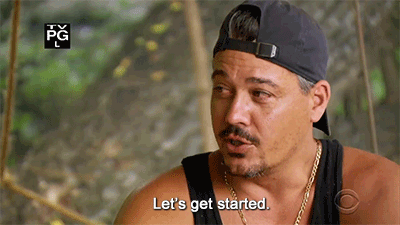

# all-the-fixins

Come on in guys! All-the-fixins is a Survivor fan page tracking seasons, players, and fans letting users message each other to discuss the game they love! The Survivor Database API is constantly expanding to render more and more information about the 40 seasons of Survivor(US).

I started watching Survivor in 2018 as background noise while I worked on other projects. About halfway through The Austrailian Outback, I was hooked and I binged the whole series in a year and a half. Some seasons I have seen multiple times, and I love the characters so much: the strategy and the way that the personality of each season changes, and how the meta of the game of Survivor constantly gets analyzed and then shaken up. Putting information into the API was exhaustive and took three nights, but I never got tired of it because I love the show. 

# Planning

[Github](https://github.com/aloha45/all-the-fixins)

[Trello](https://trello.com/b/AnSVuoxq/all-the-fixins)

# Technologies Used

- Node.js
- ExpressJS
- MongoDB
- Boostrap 4
- Express Generator
- MongooseJS
- MongoDB Atlas
- EJS Templating
- Google OAuth 2.0
- Creately
- Trello

# User Stories

- AAU, I want to be able to log-in and see my profile. I also expect the information I put into my profile to persist so that I only have to put this information in one time.
- AAU, I want to see information about different seasons of Survivor including who won, where the game was played, and when it took place.
- AAU, I want to be able to interact with other Survivor fans! I want to talk about the show I love with other people who love it as well.
- AAU, I want to be able to quickly and easily see the people I get along with in the message board. I want a friends-list to go and quickly get to my friends.
- AAU, I want to be able to read not only about the seasons, but the players of the show! Survivor is character driven and I want to know more about my favorites!
- AAU, I want to be able to chat! Wednesday Night is Survivor Night in America and I want to be able to watch and react to the episode live with other fans.

# On Launch

Upon entering the website, you are met by a landing page:

When entering the site, you are prompted to log-in via Google OAuth.

Fill out your profile! You can include your favorite season, change your avatar image, and pick a Tribal Flair!

Brush up on your survivor knowledge with the Season Database, which includes information on each of the 40 seasons of Survivor.

Check out Tree Mail! See what people are talking about around camp and offer some quips of your own. You can create Tree Mail, edit or delete it, and reply to others'. Spend a lot of time here so you can flex your Social Game and add people to your alliance. 

# Moving Forward

There are a number of goals for expansion of the application: 

- Expand API database to include player information on the scope that season information exists.
- Expand API database to include location information. Add in a map of the world, with countries that can be clicked on to render information about seasons played in the country. Fiji, the Phillipines, Nicaragua, Samoa, and others have been used multiple times!
- Enable more mobility within the website to make it less nav-bar reliant for navigation.